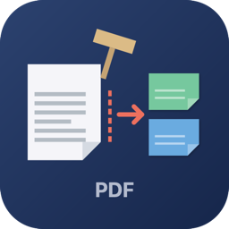

<p align="center">
  
</p>

<h1 align="center">Defendant PDF Splitter</h1>

<p align="center">
  Native macOS app that splits multi-defendant court PDFs into separate files, one per defendant.<br>
  Built for legal/process-service workflows where a single scanned PDF bundles dozens of cases.
</p>

<p align="center">
  
  
  
  
</p>

## Why

Court systems often deliver service packets as a single scanned PDF containing pages for many unrelated defendants. Manually reviewing each page, splitting the document, and naming each output file is slow and error-prone. Defendant PDF Splitter does it in one pass: drop the PDF in, assign names (auto-detected when possible), and export individually-named PDFs plus a ZIP archive.

## Features

- **Drag-and-drop loading** — drop a PDF onto the window, or click to browse
- **Auto-detect defendant names** — extracts text via PDFKit and matches court-caption patterns (`vs.`, `Defendant/Respondent`, `Respondent/Defendant`, lines after `vs.`)
- **Manual entry fallback** — for scanned/image-based PDFs with no extractable text, enter names per page
- **Page thumbnail preview** — click any page to see a full preview on the right
- **Smart grouping** — consecutive pages with the same defendant name are combined into one output PDF (Mehdi Hihi on pages 4–5 → one `Mehdi Hihi.pdf`)
- **Apply-down shortcut** — fill consecutive blank pages with the same name from a single row
- **Filename sanitization** — strips `/ \ : * ? " < > |` and de-duplicates with `Defendant Name - 2.pdf` for separate cases sharing a name
- **Export summary** — preview the full output list (filenames + page ranges + counts) before writing anything
- **ZIP archive** — auto-bundles all output PDFs into `[original]_split_by_defendant.zip`
- **Output to Desktop** — creates `split_defendants_[original_name]/` folder for easy access
- **Sandboxed** — runs in App Sandbox with only user-selected file and Desktop write permissions

## Installation

### Download

Grab the latest `.zip` from [Releases](https://github.com/eMacTh3Creator/DefendantPDFSplitter/releases), unzip, and drag **DefendantPDFSplitter.app** to `/Applications`.

The app is ad-hoc signed, so on first launch right-click → **Open** to bypass Gatekeeper. If macOS still blocks it, clear the quarantine flag:

```sh
xattr -dr com.apple.quarantine "/Applications/DefendantPDFSplitter.app"
```

### Build from source

Requires Xcode 15+ and macOS 13+.

```sh
git clone https://github.com/eMacTh3Creator/DefendantPDFSplitter.git
cd DefendantPDFSplitter
xcodebuild -project DefendantPDFSplitter.xcodeproj \
  -scheme DefendantPDFSplitter \
  -configuration Release \
  -derivedDataPath build \
  CODE_SIGN_IDENTITY="" CODE_SIGNING_REQUIRED=NO CODE_SIGNING_ALLOWED=NO build
open build/Build/Products/Release/DefendantPDFSplitter.app
```

## Usage

1. Launch the app — the drop zone appears
2. Drop a PDF onto the window (or click to browse)
3. Click **Auto Detect Names** to suggest defendant names from each page's text
4. Review the table — edit any name, or type names directly for pages where detection failed (scanned/image PDFs)
5. Use the ⬇ button next to a row to fill following blank pages with that name (handy when one defendant spans several pages)
6. Click **Export PDFs** — review the summary dialog, then confirm
7. Output appears on your Desktop in `split_defendants_[original_name]/` plus a `[original_name]_split_by_defendant.zip` next to it

## How auto-detection works

Three strategies run in order; the first match wins:

| Strategy | Looks for |
|----------|-----------|
| **Defendant label** | `Defendant/Respondent` or `Respondent/Defendant` keywords on the same line as a name (handles both `Name, Defendant` and `Defendant: Name` formats) |
| **Court caption** | A `vs.` / `v.` line, then the next non-empty line below it (the standard plaintiff-vs-defendant caption layout) |
| **Adjacent keyword** | Names on the line above or below `Defendant` / `Respondent` keywords |

Detected names are sanitized (trailing punctuation removed, `et al.` stripped) and filtered against common false positives (`Court`, `County`, `Case`, `Docket`, `Plaintiff`, etc.). The user can always edit any suggestion before exporting.

## Grouping rules

| PDF input | Output |
|-----------|--------|
| 5 pages, all different defendants | 5 PDFs, one per page |
| 5 pages with pages 4–5 = `Mehdi Hihi` | 4 PDFs (`Mehdi Hihi.pdf` is 2 pages) |
| 5 pages with pages 1 and 4 both `John Doe` (separate cases) | 5 PDFs (`John Doe.pdf` from page 1, `John Doe - 2.pdf` from page 4) |
| Any page missing a name | Export blocks with a warning bar listing the unassigned page numbers |

Same defendant on **consecutive** pages = one PDF. Same defendant on **non-consecutive** pages = separate PDFs with numeric suffixes (assumed to be different cases).

## Architecture

| Layer | Files |
|-------|-------|
| **Models** | `PageAssignment`, `DefendantGroup` |
| **Services** | `PDFTextExtractor` (PDFKit text scrape), `DefendantNameDetector` (caption/label heuristics), `PDFExporter` (grouping + per-defendant PDF write), `ZipService` (`/usr/bin/zip` shell-out) |
| **ViewModel** | `PDFSplitterViewModel` (state machine: idle → loaded → exporting → exported, plus warning/error messaging) |
| **Views** | `ContentView`, `DropZoneView`, `PageAssignmentTableView`, `ExportSummaryView` |

All file I/O is local. No network calls, no cloud dependencies, no telemetry.

## Requirements

- macOS 13.0 (Ventura) or later
- Apple Silicon or Intel Mac
- A PDF — text-extractable (digital) or scanned (manual entry)

## License

MIT
